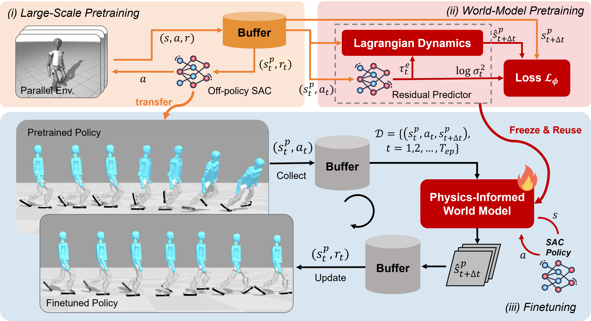
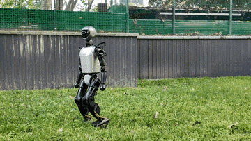
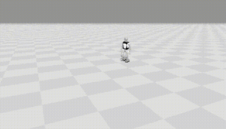
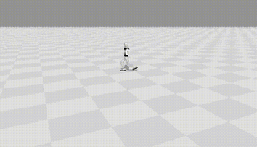

<div id="top" align="center">

<p align="center">
  
</p>

<h2>LIFT: Large-scale Pretraining & Efficient Finetuning for Humanoid Control</h2>

<p align="center">
  <a href="https://arxiv.org/abs/2601.21363">
    
  </a>
  <a href="https://lift-humanoid.github.io/">
    
  </a>
</p>

<p align="center">
  <b><a href="https://weidonghuang.com">Weidong Huang</a></b> · Zhehan Li · Hangxin Liu · Biao Hou · Yao Su· <a href="https://jingwen-zhang-aaron.github.io/">Jingwen Zhang</a><sup>†</sup><br>
   · Primary contact: Weidong Huang
  <a href="mailto:bigeasthuang@gmail.com">(bigeasthuang@gmail.com)</a>
</p>

</div>

---

## 🔥 Highlights

- **Large-scale humanoid policy pretraining** with off-policy **SAC** (large-batch updates + high **UTD**) for fast, robust convergence in massively parallel simulation.
- **Zero-shot deployment** of pretrained policies to real humanoid robots.
- **Safe and sample-efficient fine-tuning** via **model-based RL**, executing **deterministic actions** in the real environment while confining **stochastic exploration** to a **physics-informed world model**.

## 📋 Overview

**LIFT (Large-scale pretraIning and efficient FineTuning)** is a three-stage framework that bridges scalable simulation pretraining and safe, efficient adaptation for humanoid control:

1. **Policy pretraining (simulation):** We scale off-policy **Soft Actor-Critic (SAC)** with large-batch updates and a high Update-To-Data (UTD) ratio to enable fast and reliable learning in massively parallel GPU simulation, achieving **zero-shot deployment** on real robots.
2. **World model pretraining:** We learn a **physics-informed world model** from the pretraining data by combining structured physical priors (e.g., Lagrangian dynamics) with a residual predictor to capture contact forces and other unmodeled effects.
3. **Efficient fine-tuning (new environments):** During fine-tuning, we execute only **deterministic actions** in the real environment for data collection, while **stochastic exploration** is performed through rollouts inside the learned world model—improving safety and preserving exploratory coverage.

<p align="center">
  
</p>

---
<div align="center">
<table>
  <tr>
    <th style="text-align:center;">Real World Deployment</th>
    <th style="text-align:center;">Brax (Sim2Sim)</th>
    <th style="text-align:center;">Brax (After Finetuning)</th>
  </tr>
  <tr>
    <td align="center">
      <a href="assets/video/T1_walk_on_grass_h264.gif">
        
      </a>
    </td>
    <td align="center">
      <a href="assets/video/t1_1.5vel_pretrain.gif">
        
      </a>
    </td>
    <td align="center">
      <a href="assets/video/t1_1.5vel_finetune.gif">
        
      </a>
    </td>
  </tr>

</table>
</div>


**See more (videos + code) on the project website:** https://lift-humanoid.github.io/

---

## 📦 Installation & Configuration

(Ubuntu 22.04 and Python 3.10 recommended). Minimal quickstart:

This code is tested on NVIDIA H800 and 4090.

```bash
conda create -n lift python=3.10 -c conda-forge -y
conda activate lift
cd mujoco_playground
pip install -e .
cd ..
cd brax_env
pip install -e .
cd ..
pip install -r requirements.txt

```

## 🔁 Process Overview

**Train Policy → Pretrain World Model → Finetune**

* **Train Policy**: pretrain with SAC (large batch + high UTD) in MuJoCo Playground and enable zero-shot deployment of the pretrained policy on physical humanoids.

* **Pretrain World Model**: pretrain the physics-informed world model using the SAC offline data.

* **Sim2Sim and Fine-tuning**: transfer the pretrained policy to Brax and **fine-tune** with a physics-informed world model.
  The environment executes **deterministic** actions; **stochastic exploration** is confined to the world model.


---

## 1) Train Policy (MuJoCo Playground)

### Recommended pretraining commands (for fine-tuning data)

Use **T1LowDimSimFinetuneJoystickFlatTerrain** or **G1LowDimJoystickFlatTerrain** to pretrain the policy and save replay data for world-model pretraining + fine-tuning.

```bash

# T1 Low-Dim Sim Finetune (flat) — policy pretraining + buffer for WM/fine-tuning
CUDA_VISIBLE_DEVICES=0 python train_in_mujoco_playground.py --env_name=T1LowDimSimFinetuneJoystickFlatTerrain --domain_randomization --num_timesteps 40000000 --num_evals 10 --save_buffer_data  --wandb_entity your_wandb_entity 

# G1 Low-Dim (flat) — policy pretraining + buffer for WM/fine-tuning
CUDA_VISIBLE_DEVICES=0 python train_in_mujoco_playground.py --env_name=G1LowDimJoystickFlatTerrain --domain_randomization --num_timesteps 60000000 --num_evals 10 --save_buffer_data  --wandb_entity your_wandb_entity 

# T1 Low-Dim Real World Finetune (flat) — policy pretraining + buffer for WM/fine-tuning (this setting is used for real world finetune experiment)
CUDA_VISIBLE_DEVICES=0 python train_in_mujoco_playground.py --env_name=T1LowDimRealFinetuneJoystickFlatTerrain --domain_randomization --num_timesteps 40000000 --num_evals 10 --save_buffer_data  --wandb_entity your_wandb_entity 

```

### Other pretrain environments used in the paper results

- `G1JoystickFlatTerrain`
- `G1JoystickRoughTerrain`
- `T1JoystickRoughTerrain`
- `T1JoystickFlatTerrain`
- `T1LowDimJoystickRoughTerrain`
- `T1LowDimJoystickFlatTerrain`


```bash
# T1LowDimJoystickRoughTerrain
CUDA_VISIBLE_DEVICES=0 python train_in_mujoco_playground.py --env_name=T1LowDimJoystickRoughTerrain --wandb_entity your_wandb_entity --domain_randomization --suffix xxx

# T1LowDimJoystickFlatTerrain
CUDA_VISIBLE_DEVICES=0 python train_in_mujoco_playground.py --env_name=T1LowDimJoystickFlatTerrain --wandb_entity your_wandb_entity --domain_randomization --suffix xxx

# G1JoystickFlatTerrain
CUDA_VISIBLE_DEVICES=0 python -u train_in_mujoco_playground.py --env_name=G1JoystickFlatTerrain --wandb_entity your_wandb_entity  --suffix xxx

# G1JoystickRoughTerrain
CUDA_VISIBLE_DEVICES=0 python train_in_mujoco_playground.py --env_name=G1JoystickRoughTerrain --wandb_entity your_wandb_entity  --suffix xxx

# T1JoystickRoughTerrain
CUDA_VISIBLE_DEVICES=0 python train_in_mujoco_playground.py --env_name=T1JoystickRoughTerrain --wandb_entity your_wandb_entity  --suffix xxx

# T1JoystickFlatTerrain
CUDA_VISIBLE_DEVICES=0 python train_in_mujoco_playground.py --env_name=T1JoystickFlatTerrain --wandb_entity your_wandb_entity  --suffix xxx

````


### Outputs & structure

Training logs and artifacts are saved under:

```
logs/
  <ENV>-<YYYYmmdd-HHMMSS>-<suffix?>/
    checkpoints/     # config snapshot (e.g., config.json)
    policies/        # policy{step}.pkl (normalizer + policy params via dill)
    videos/          # rollout{step}.mp4 (if --render)
    buffer_data/     # saved replay (if --save_buffer_data)
```

---

### 2. Evaluate pretrained policy in Brax

**Model naming**
- `*.pkl`: direct **sim-to-sim zero-shot** from MuJoCo Playground to Brax (no Brax training).

**Note**
- Rendering exports to HTML
-  Pretraining sampled x-velocity uniformly in `[-1, 1] m/s`. During fine-tuning, set new targets (e.g., `1.0/1.2/1.5 m/s`).
-  The environment executes **deterministic** actions.
**Examples**

```bash
# T1 — zero-shot sim2sim
CUDA_VISIBLE_DEVICES=0 python eval_in_brax.py --env t1 --model models/T1LowDimSimFinetuneJoystickFlatTerrain_policy40009000.pkl

```


---


---
### 3. Pretrain the world model
```bash
# T1 Low-Dim Sim Finetune (flat)
CUDA_VISIBLE_DEVICES=0 python -u train_wm_from_file.py --env_name=T1LowDimSimFinetuneJoystickFlatTerrain --data_path=logs/T1LowDimSimFinetuneJoystickFlatTerrain-YYYYmmdd-HHMMSS-<suffix> --wandb_entity your_wandb_entity

# G1 Low-Dim (flat)
CUDA_VISIBLE_DEVICES=0 python -u train_wm_from_file.py --env_name=G1LowDimJoystickFlatTerrain --data_path logs/G1LowDimJoystickFlatTerrain-YYYYmmdd-HHMMSS-<suffix> --wandb_entity your_wandb_entity
```

Training logs and artifacts are saved under:

```
logs/
  <ENV>-<YYYYmmdd-HHMMSS>-<suffix?>/
    checkpoints/     # config snapshot (e.g., config.json)
    videos/          # rollout{step}.mp4 (if --render)
    wm_states/     # world model state
```


---
### 4. Fine-tune the policy and the world model
```bash

# Finetune in Brax (sim2sim) with pretrained policy + WM
CUDA_VISIBLE_DEVICES=0 python finetune.py --env_name=T1LowDimSimFinetuneJoystickFlatTerrain --suffix=sim2sim --ac_training_state_path=logs/T1LowDimSimFinetuneJoystickFlatTerrain-YYYYmmdd-HHMMSS-<suffix>/policies/policyXXXX.pkl --wm_training_state_path=logs/T1LowDimSimFinetuneJoystickFlatTerrain-YYYYmmdd-HHMMSS-<suffix>/wm_states/wm_stateXXXXX.pkl --wandb_entity your_wandb_entity

# example:
CUDA_VISIBLE_DEVICES=0 python finetune.py --env_name=T1LowDimSimFinetuneJoystickFlatTerrain --suffix=sim2sim --ac_training_state_path=models/T1LowDimSimFinetuneJoystickFlatTerrain_policy40009000.pkl --wm_training_state_path=models/T1LowDimSimFinetuneJoystickFlatTerrain_wm_state40.pkl --wandb_entity your_wandb_entity

# G1 Low-Dim (flat) fine-tune
CUDA_VISIBLE_DEVICES=0 python finetune.py --env_name=G1LowDimJoystickFlatTerrain --suffix=sim2sim --ac_training_state_path=logs/G1LowDimJoystickFlatTerrain-YYYYmmdd-HHMMSS-<suffix>/policies/policyXXXX.pkl --wm_training_state_path=logs/G1LowDimJoystickFlatTerrain-YYYYmmdd-HHMMSS-<suffix>/wm_states/wm_stateXXXXX.pkl --wandb_entity your_wandb_entity

# Real-world fine-tune uses T1LowDimRealFinetuneJoystickFlatTerrain
CUDA_VISIBLE_DEVICES=0 python finetune.py --env_name=T1LowDimRealFinetuneJoystickFlatTerrain --suffix=real --ac_training_state_path=logs/T1LowDimRealFinetuneJoystickFlatTerrain-YYYYmmdd-HHMMSS-<suffix>/policies/policyXXXX.pkl --wm_training_state_path=logs/T1LowDimRealFinetuneJoystickFlatTerrain-YYYYmmdd-HHMMSS-<suffix>/wm_states/wm_stateXXXXX.pkl --wandb_entity your_wandb_entity

```


### 4. Sim2Real zero-shot deployment (T1LowDimJoystickRoughTerrain)

For **zero-shot real deployment**, pretrain on **`T1LowDimJoystickRoughTerrain`**, convert the SAC policy to TorchScript, validate in MuJoCo, then deploy with BoosterGym.

```bash
# 1) Pretrain the zero-shot policy
CUDA_VISIBLE_DEVICES=0 python train_in_mujoco_playground.py --env_name=T1LowDimJoystickRoughTerrain --domain_randomization --suffix zeroshot

# 2) Convert SAC .pkl to TorchScript and check performance in MuJoCo (converts automatically if needed)
python mujoco_env/play_mujoco.py --sac_training_state_path logs/T1LowDimJoystickRoughTerrain-YYYYmmdd-HHMMSS-zeroshot/policies/policyXXXX.pkl --render

example:
python mujoco_env/play_mujoco.py --sac_training_state_path models/T1LowDimJoystickRoughTerrain_policy110119000.pkl

# this policy is trained using the T1LowDimJoystickRoughTerrain
```

Then deploy the TorchScript policy with the **BoosterGym** real-robot deployment pipeline.


---
### 5. Optuna SAC hyperparameter tuning (for your own robot)

Use `train_in_mujoco_playground_optuna.py` to tune SAC parameters for any robot/environment.
You could use the following command for multi-GPU hyperparameter tuning.
```bash
# Example: tune on T1 Low-Dim (flat)
CUDA_VISIBLE_DEVICES=0 python train_in_mujoco_playground_optuna.py --env_name=T1LowDimJoystickRoughTerrain --storage=sqlite:///optuna_sac_t1.db --study_name=t1_sac_tuning --sampler=cmaes --domain_randomization --popsize=12
```


## ⭐ Citation
If you find this repository helpful, please consider citing:
```
@inproceedings{
lifthumanoid,
title={Towards Bridging the Gap between Large-Scale Pretraining and Efficient Finetuning for Humanoid Control},
author={Weidong Huang and Zhehan Li and Hangxin Liu and Biao Hou and Yao Su and Jingwen Zhang},
booktitle={The Fourteenth International Conference on Learning Representations},
year={2026},
url={https://openreview.net/forum?id=NEOTsyyYH7}
}

```

---

## 🙏 Acknowledgments

Thanks to the open-source community for foundational tooling and datasets.

### Optuna

```bibtex
@inproceedings{akiba2019optuna,
  title={{O}ptuna: A Next-Generation Hyperparameter Optimization Framework},
  author={Akiba, Takuya and Sano, Shotaro and Yanase, Toshihiko and Ohta, Takeru and Koyama, Masanori},
  booktitle={The 25th ACM SIGKDD International Conference on Knowledge Discovery \& Data Mining},
  pages={2623--2631},
  year={2019}
}
```
### Brax
```bibtex
@software{brax2021github,
  author = {C. Daniel Freeman and Erik Frey and Anton Raichuk and Sertan Girgin and Igor Mordatch and Olivier Bachem},
  title = {Brax - A Differentiable Physics Engine for Large Scale Rigid Body Simulation},
  url = {http://github.com/google/brax},
  version = {0.14.0},
  year = {2021},
}
```

### SSRL
```bibtex
@inproceedings{levy2024learning,
  title={Learning to Walk from Three Minutes of Real-World Data with Semi-structured Dynamics Models},
  author={Levy, Jacob and Westenbroek, Tyler and Fridovich-Keil, David},
  booktitle={8th Annual Conference on Robot Learning},
  year={2024}
}
```

### MuJoCo Playground
```bibtex
@article{zakka2025mujoco,
  title={MuJoCo Playground},
  author={Zakka, Kevin and Tabanpour, Baruch and Liao, Qiayuan and Haiderbhai, Mustafa and Holt, Samuel and Luo, Jing Yuan and Allshire, Arthur and Frey, Erik and Sreenath, Koushil and Kahrs, Lueder A and others},
  journal={arXiv preprint arXiv:2502.08844},
  year={2025}
}
```


### Getting SAC to Work on a Massive Parallel Simulator
```bibtex
@article{raffin2025isaacsim,
  title   = "Getting SAC to Work on a Massive Parallel Simulator: An RL Journey With Off-Policy Algorithms",
  author  = "Raffin, Antonin",
  journal = "araffin.github.io",
  year    = "2025",
  month   = "Feb",
  url     = "https://araffin.github.io/post/sac-massive-sim/"
}
```

### Booster Gym
```bibtex
@article{wang2025booster,
  title={Booster Gym: An End-to-End Reinforcement Learning Framework for Humanoid Robot Locomotion},
  author={Wang, Yushi and Chen, Penghui and Han, Xinyu and Wu, Feng and Zhao, Mingguo},
  journal={arXiv preprint arXiv:2506.15132},
  year={2025}
}
```
### BeyondMimic
```bibtex
@article{liao2025beyondmimic,
  title={Beyondmimic: From motion tracking to versatile humanoid control via guided diffusion},
  author={Liao, Qiayuan and Truong, Takara E and Huang, Xiaoyu and Gao, Yuman and Tevet, Guy and Sreenath, Koushil and Liu, C Karen},
  journal={arXiv preprint arXiv:2508.08241},
  year={2025}
}
```
---
